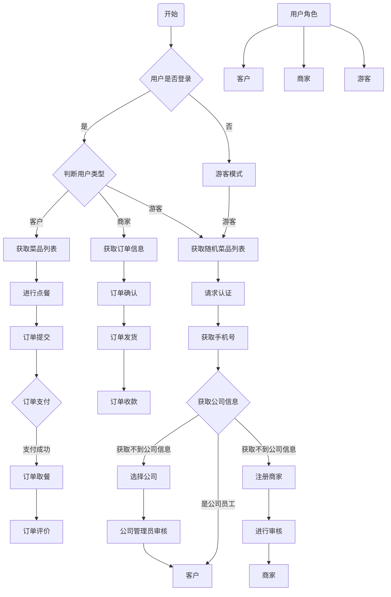

# 金饭碗

### 项目维护

#### 进入项目路径

```
cd /opt/jfw
```

#### 进入虚拟环境

```
source venv/bin/activate
```

#### 查看进程

```
ps auxw | grep python3
```

#### 服务启动

```
nohup python3 manage.py runserver 0.0.0.0:9091 &
```

### 项目安装

#### 进入路径拉取项目代码

```
cd /opt
git clone https://github.com/ginguocun/jfw.git
```

#### 创建虚拟环境 venv

```sh
python3 -m venv venv
```

#### 启动虚拟环境 

```
source venv/bin/activate
```

#### 更新 setuptools pip

```
pip3 install --upgrade setuptools pip
```

#### 安装依赖

```
pip install -r requirements.txt
```

## 用户小程序进入流程

